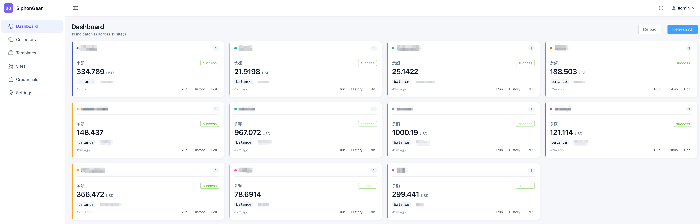

# SiphonGear

A configuration-driven web data collector with a pluggable `Input → Fetch → Transform → Parse → Extract` pipeline. Originally built to track recharge balances across multiple sites, generalized into a tool for any periodic web collection task. Single Go binary with embedded Vue 3 + Element Plus UI.



## 中文简介

SiphonGear 是一个**配置驱动的通用采集与指标平台**。最初目标是定时查询多个网站的充值余额，已泛化为可扩展的 Web 爬虫/采集工具：

- 每个采集任务（Collector）由一条 `Input → Fetch → Transform → Parse → Extract` 流水线组成，每个环节都是可插拔的 Step。
- Web 界面（Vue 3 + Element Plus）配置任务、调度、指标，所有结果落库形成时间序列。
- 调度支持固定间隔 / cron 表达式 / 事件链式触发三种模式。
- 内置任务模板，"From Template" 一键创建 Site + Credential + Collector + Pipeline + Indicators。
- 凭证 AES-GCM 加密存储；JWT 单用户登录。
- 默认 SQLite（纯 Go 驱动，无 cgo），也支持 MySQL / Postgres。
- 单二进制（Go + go:embed 打包前端），部署友好。

## Features

- Pluggable pipeline with 15 built-in steps (HTTP, headless browser, JSONPath, CSS selectors, regex, JS scripting via goja, more)
- Web UI for visually configuring collectors, credentials, schedules, and indicators
- Built-in task templates ("From Template" — `sub2api-balance` ships out of the box; create your own under `internal/templates/builtin.go`)
- Schedule via fixed interval, cron, or event chaining
- Time-series storage with per-indicator history
- AES-GCM encrypted credentials, JWT auth (single user)
- SQLite by default (pure Go driver, no cgo); MySQL / Postgres supported
- Single static binary with embedded SPA

## Tech Stack

| Layer | Choice |
|---|---|
| Language | Go 1.25+ |
| HTTP | Gin |
| ORM | GORM (`glebarez/sqlite`) |
| Logger | zerolog |
| JSON | bytedance/sonic |
| Browser | chromedp |
| Scheduler | robfig/cron v3 |
| Script | dop251/goja |
| Frontend | Vue 3 + TypeScript + Vite + Element Plus + Pinia + Vue Router + ECharts |

## Quick Start

### Prerequisites

- Go 1.25+
- Node 22+
- (Optional) Chrome / Chromium for `fetch.browser` step

### Build

```bash
git clone <this-repo> siphongear
cd siphongear

cp config.yaml.example config.yaml
# edit config.yaml — set master_key and jwt_secret to long random strings

make build           # builds web/dist + bin/siphongear
./bin/siphongear --config config.yaml
```

Visit http://localhost:7080 and log in with `admin` / `admin` (configurable via `auth.init_username` / `auth.init_password` on first run; change it under Settings).

### Dev mode

```bash
# terminal 1: backend
SIPHON_CONFIG=config.yaml go run ./cmd/server

# terminal 2: frontend with HMR
cd web && npm install && npm run dev
# http://localhost:5173 (proxies /api -> :7080)
```

### Docker

Build locally:

```bash
docker build -t siphongear .
docker run -p 7080:7080 \
  -e SIPHON_AUTH__MASTER_KEY=$(openssl rand -hex 32) \
  -e SIPHON_AUTH__JWT_SECRET=$(openssl rand -hex 32) \
  -v siphongear-data:/app/data \
  siphongear
```

Or pull the published image (`sunshow/siphongear:latest`):

```bash
docker pull sunshow/siphongear:latest
docker run -d --name siphongear -p 7080:7080 \
  -e SIPHON_AUTH__MASTER_KEY=$(openssl rand -hex 32) \
  -e SIPHON_AUTH__JWT_SECRET=$(openssl rand -hex 32) \
  -v siphongear-data:/app/data \
  sunshow/siphongear:latest
```

The container runs as non-root user `siphon` (uid 1000); the SQLite DB lives in `/app/data` (declared `VOLUME`).

### Docker Compose

A ready-to-use `docker-compose.yaml` is included; it pulls `sunshow/siphongear:latest` and persists data into a named volume:

```bash
cp .env.example .env
# edit .env — set SIPHON_AUTH__MASTER_KEY and SIPHON_AUTH__JWT_SECRET to long random strings
docker compose pull
docker compose up -d
docker compose logs -f siphongear
```

The compose file uses `${VAR:?...}` for the two required secrets, so `compose up` fails fast if they're not set in `.env`.

#### Persisting data: named volume vs bind mount

By default `docker-compose.yaml` uses a **named volume** (`siphongear-data`). This is the painless path because Docker initializes the volume with the container's existing `/app/data` ownership (uid 1000 `siphon`), so writes just work.

If you want to bind-mount a host directory instead (e.g. for direct backup/inspection), edit the `volumes:` section in `docker-compose.yaml` and **chown the host dir to uid 1000 first**:

```bash
mkdir -p ./data
sudo chown -R 1000:1000 ./data
```

Otherwise the container will fail with this misleading SQLite error:

```
{"level":"error","error":"unable to open database file: out of memory (14)","message":"open db"}
```

That `out of memory` text is `SQLITE_CANTOPEN` (error code 14) — the real cause is the host directory being owned by your local user (`sunshow:staff` mode 0755), so uid 1000 inside the container can't create the WAL/SHM files. Either chown the dir to 1000 or stick with the named volume.

Reset everything (including the DB):

```bash
docker compose down -v
```

## Configuration

All keys can be overridden by env vars: `SIPHON_<SECTION>__<KEY>` (uppercase, double underscore between path segments). Example: `auth.master_key` → `SIPHON_AUTH__MASTER_KEY`.

```yaml
server:
  host: 0.0.0.0
  port: 7080

database:
  driver: sqlite          # sqlite | mysql | postgres
  dsn: data/siphongear.db

auth:
  jwt_secret: <required>
  master_key: <required, encrypts credential payloads>
  init_username: admin
  init_password: admin
  token_ttl_hrs: 168

log:
  level: info
  pretty: true

browser:
  ws_url: ""              # remote chromedp endpoint, e.g. ws://chrome:9222

runner:
  max_concurrency: 4
  default_timeout: 60
```

## Concept Model

```
Site -- has many --> Credentials
Site -- has many --> Collectors
Collector -- has one pipeline (JSON) --> Steps[]
Collector -- has many --> Indicators
Indicator -- has many --> DataPoints (time series)
Run -- has many --> StepLogs
```

A Collector's pipeline is a flat ordered list of steps. Each step has a `kind` (one of the registered step kinds) and a `config` object. Variables flow between steps via `Payload.Vars`; the body and parsed object also persist across steps.

## Built-in Steps

| Stage | Kind | Notes |
|---|---|---|
| input | `input.static` | Inject literal vars |
| input | `input.credential` | Load encrypted credential by ID into vars |
| input | `script.js.input` | goja sandbox |
| fetch | `fetch.http` | Resty client, templated url/headers/body |
| fetch | `fetch.browser` | chromedp navigate / evaluate |
| transform | `transform.gunzip` | |
| transform | `transform.charset` | Detect via Content-Type |
| transform | `transform.template` | text/template render |
| transform | `script.js.transform` | |
| parse | `parse.json` | bytedance/sonic into Object |
| parse | `parse.html` | goquery document |
| extract | `extract.jsonpath` | ohler55/ojg |
| extract | `extract.css` | goquery selectors with optional attribute |
| extract | `extract.regex` | named groups become vars |
| extract | `script.js.extract` | |

Step `config` fields are exposed by `GET /api/v1/registry/steps`. The frontend's `StepEditor.vue` renders forms from this metadata.

## Templates

Templates pre-fill an entire Collector setup. From the **New Collector** screen, click **From Template**, pick the template, fill the prompted variables and credential fields, click Apply — Site, Credential, Collector, Pipeline, and Indicators are all created in one click.

### 内置模板（Built-in Templates）

| 名称 | 说明 |
|---|---|
| `sub2api-balance` | sub2api 风格网关：邮箱+密码登录后取账户余额 |
| `newapi-balance` | NewAPI（[QuantumNous/new-api](https://github.com/QuantumNous/new-api)）：用户名+密码 cookie session，折算成 USD 余额与已用 |
| `newapi-balance-accesstoken` | NewAPI：使用「系统访问令牌」+ user_id 免登录直取，折算成 USD 余额与已用 |

> 模板源码位于 `internal/templates/builtin.go`，运行时也可通过 `GET /api/v1/templates` 获取完整定义。

### 添加新模板

To register a new template, edit `internal/templates/builtin.go`:

```go
Register(Template{
    Name:            "my-template",
    Description:     "...",
    NeedsCredential: true,
    CredentialHint:  &TemplateCredentialHint{Type: "token", Fields: ...},
    Variables:       []TemplateVariable{...},
    Pipeline:        pipeline.Definition{Steps: []pipeline.StepConfig{...}},
    Indicators:      []TemplateIndicator{...},
})
```

Frontend variable substitution uses `{{BASE_URL}}` style placeholders (substituted before save). Runtime templating in step configs uses `{{.vars.foo}}` (Go text/template, evaluated each run).

## API

Base URL: `/api/v1`. All routes except `/auth/login` and `/healthz` require `Authorization: Bearer <token>`.

```
POST   /auth/login                         { username, password } -> { token, user }
GET    /auth/me
POST   /auth/password                      { old_password, new_password }

GET    /registry/steps                     metadata for UI form rendering
GET    /templates
GET    /templates/:name

CRUD   /sites
CRUD   /credentials                        payload encrypted at rest
CRUD   /collectors

POST   /collectors/:id/run                 manual trigger, sync result
POST   /collectors/:id/dryrun              run without persisting; returns step logs
GET    /collectors/:id/runs?limit=50
GET    /collectors/:id/datapoints?indicator_id=&from=&to=&limit=
GET    /collectors/:id/indicators
POST   /collectors/:id/indicators
PUT    /indicators/:id
DELETE /indicators/:id

GET    /runs/:id                           run with all step logs
GET    /dashboard                          all indicators with latest value, grouped by site
```

## Development

```bash
make tidy        # go mod tidy
make test        # go test ./...
make web         # build SPA only
make server      # build Go binary only
make build       # web + server
make clean       # nuke bin/ web/dist/ data/
```

The pipeline engine has end-to-end tests in `internal/pipeline/engine_test.go`. To verify against a live target, see the smoke-test pattern used during development (login → POST /collectors → POST /run).

## Project Layout

```
siphongear/
├── cmd/server/                 entry point
├── internal/
│   ├── api/                    Gin routes & handlers
│   ├── auth/                   bcrypt + JWT
│   ├── config/                 koanf yaml + env
│   ├── crypto/                 AES-GCM cipher
│   ├── events/                 in-memory pub/sub
│   ├── pipeline/               Step / Engine / Registry
│   ├── runner/                 Trigger collector, persist run/step/datapoints
│   ├── scheduler/              cron + event subscriptions
│   ├── steps/                  built-in step kinds
│   ├── store/                  GORM models + migration
│   └── templates/              built-in task templates
├── pkg/logger/                 zerolog wrapper
├── web/                        Vue 3 SPA, embedded via go:embed
├── config.yaml.example
├── .env.example
├── Dockerfile
├── docker-compose.yaml
├── Jenkinsfile
└── Makefile
```

## License

Personal project — no license declared yet.
